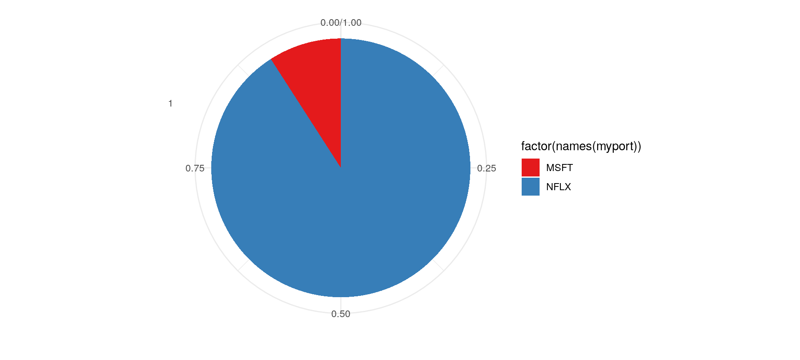

datrader
========

The goal of datrader is to help people do intelligent trading.

Example
-------

This is a basic example which shows you how to create a portfolio in a market. In this setting we fake the market by only loading three instruments from the package itself namely FB, MSFT and NFLX.

``` r
# Load library
library(datrader)
library(ggplot2)
library(scales)

# Get data from package
mypath <- system.file('extdata', package = 'datrader')
mylist <- loadExistingInstruments(mypath)

# Define a function for ranking an instrument and selecting it for investment
rankInstrument <- function(x) tail(momentum(Cl(x), n=90), 1)
selectInstrument <- function(x) rankInstrument(x) > 5

# Create a portfolio from these functions
myport <- createPortfolio(mylist, selectInstrument, rankInstrument, topN=3)
qplot(x=as.factor(1), y=myport, fill=factor(names(myport))) + 
  geom_bar(stat="identity", width = 1) + coord_polar(theta = "y") + xlab("") + 
  ylab("") + theme_minimal() + scale_fill_discrete("Instrument") + 
  scale_fill_brewer(type = "qual", palette = 6)
```


